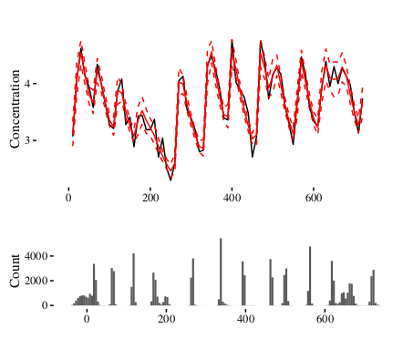

--- 
title: "Bayesian Pulsatile Hormone Modeling with R"
subtitle: "Some subtitle"
author: "Nichole E Carlson, Karen Liu, Matthew J Mulvahill, and Ken Horton"
date: "`r Sys.Date()`"
knit: "bookdown::render_book"
site: bookdown::bookdown_site
output: 
  bookdown::gitbook:
    includes:
      in_header: math_definitions.tex
documentclass: book
bibliography: [book.bib, packages.bib]
biblio-style: apalike
link-citations: true
links-as-notes: true
lot: yes
lof: yes
fontsize: 12pt
monofont: "Source Code Pro"
monofontoptions: "Scale=0.7"
colorlinks: true
github-repo: BayesPulse/bayesian-pulsatile-hormone-modeling
cover-image: images/predicted.png
description: "A guide to Bayesian pulsatile hormone modeling using the `pulsate` R package"
---

```{r include=FALSE}
# automatically create a bib database for R packages # via tidytext
knitr::write_bib(c(.packages(), 'bookdown', 'knitr', 'rmarkdown'),
								 'packages.bib')
```

# Preface {-}



Hello world!


# Introduction


